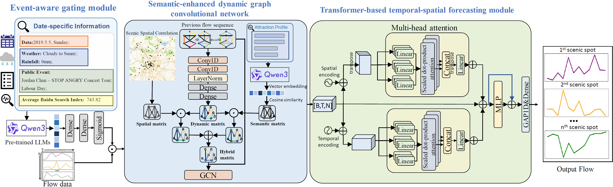

# EAD-STN

## Scenic Spot Crowd Flow Prediction: Combining Large Language Model Semantic Understanding and Spatio-Temporal Network

This repository provides the implementation of the event-aware dynamic spatial-temporal network (EAD-STN) for scenic spot crowd flow forecasting.

## Environment Setup

The environment described in `requirements.txt` is for running the EAD-STN forecasting model:

```bash
pip install -r requirements.txt
```

Main dependencies:

- Python >= 3.9
- tensorflow==2.10
- numpy==1.26.4
- joblib==1.5.1
- pandas==2.3.0
- scikit-learn==1.7.0
- CUDA >= 11.2, if using GPU

## LLM Embedding Environment

The files in `LLM_embedding/` require a separate environment for Qwen3-based text generation and embedding extraction. Please prepare the following dependencies when running this part:

```bash
pip install -r requirements_LLM.txt
```

- torch==2.7.0
- sentence-transformers==5.0.0
- pandas==2.2.3
- numpy==2.0.2
- modelscope==1.28.0
- tqdm

The `LLM_embedding/` files use Chinese in the code comments, collected information, and prompts. This is because Qwen3 has strong Chinese-language capability, and this study focuses on Chinese scenic spots and public events. Therefore, the event descriptions, attraction semantic information, and prompt inputs are presented in Chinese to better match the original context.

## Overall Architecture

This is the framework of the event-aware dynamic spatial-temporal network (EAD-STN).



## Citation

If you find this repository helpful, please consider citing our work.
The corresponding paper is currently under review and will be released soon.

Citation information will be updated here once the paper is published.
